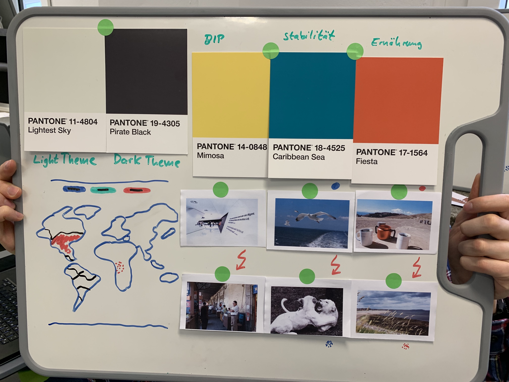
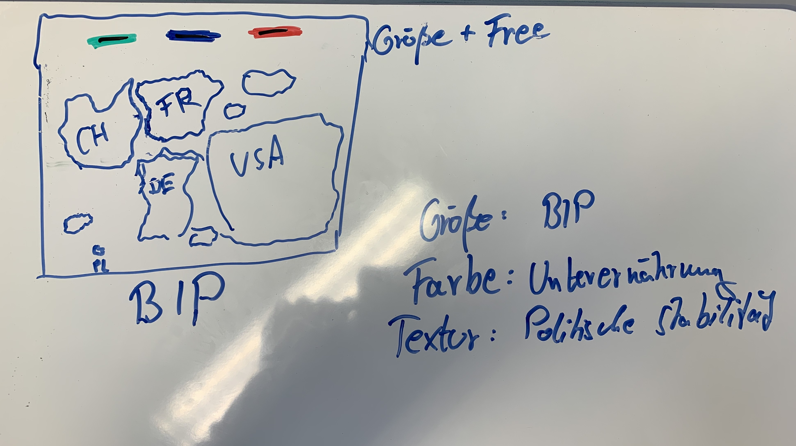
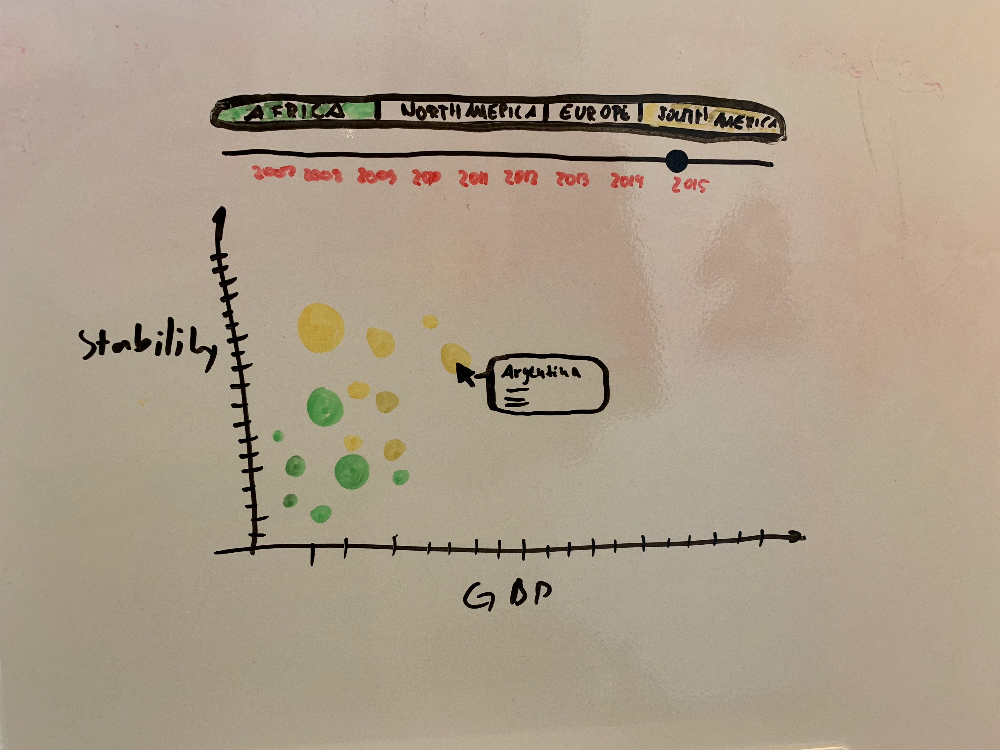
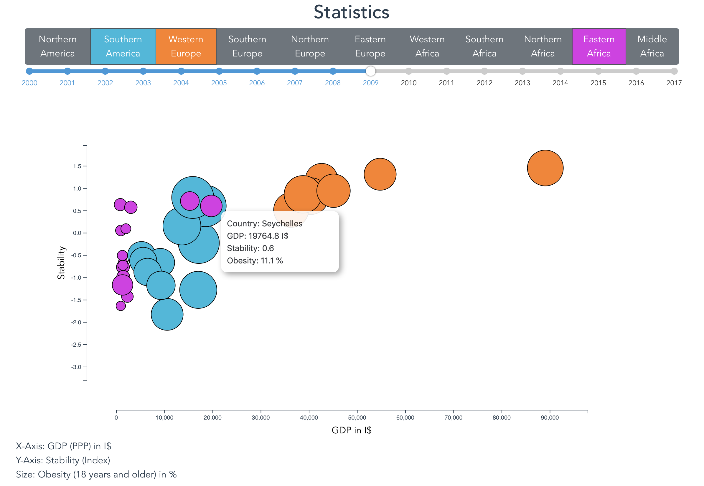

# [fit] D3 Visualisierung
### Thema: Food Security Indicators
##### Christopher Praas, Kristof Kind, Martin List

---

# Workshop
- Zugeteilte Aufgabe: Kartendarstellung 
- Idee Interaktive Karte mit Detaildarstellung 
- Eigenschaften
	- BIP (GDP) in I$
	- Politische Stabilität (Index)
	- Fettleibigkeit (über 18 Jahre) in %
 
--- 

---

# Feedback

- Eigenschaften **nicht isoliert** darstellen (Detailansicht), damit Zusammenhänge besser erkennbar sind 
- Neue Idee: Länder schweben unabhängig in freier Fläche 
- Abbildung der Eigenschaften auf Flächeninhalt, Farbe und Textur
- Interaktion Einblendung Top 5 / Worst 5 

---

 

---

# Umsetzung & Probleme

- Darstellung einzelner Länder schwieriger als angenommen
- Änderung Darstellung Länder in Kreise
	- Beibehalten Darstellung Eigenschaft über Flächeninhalt 
	- Achsen zur Visualisierung anderer Eigenschaften

---

# Refinement

- Keine richtige Kartendarstellung mehr -> Zeitbasiert
- Interaktion über Zeitleiste und Selektion der Regionen
- Tooltip zeigt Infos bei Hovering mit Mouse

---

---

---

# Demo

